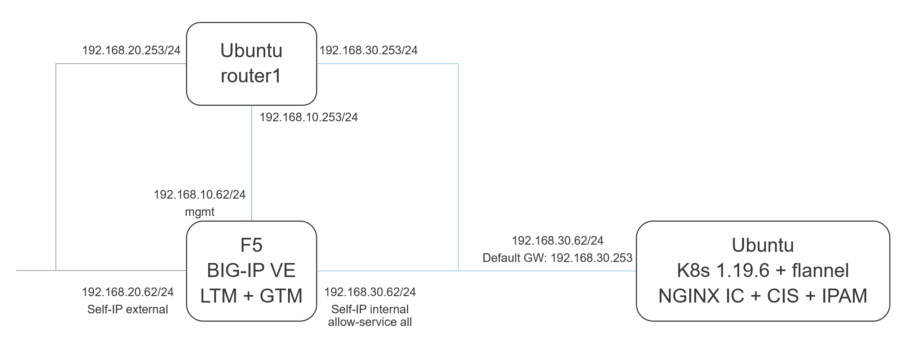
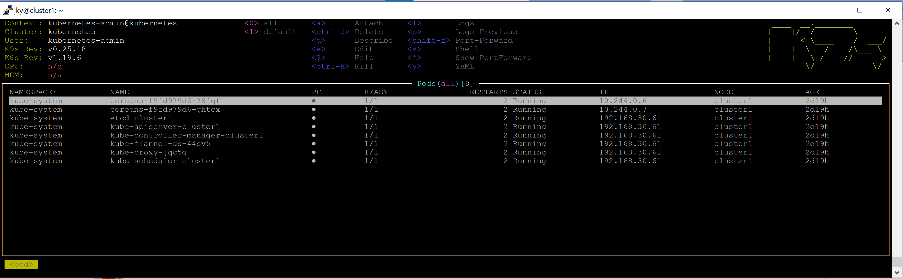

# My Notes on Setting Up AAKC Lab
This note is based on the guide from [Mark Dittmer's guide](https://github.com/mdditt2000/k8s-bigip-ctlr/tree/main/user_guides/externaldns-nginx). If you want exactly same setup then you can follow this note. Otherwise, this might serve as high level guidance to build your own AAKC lab.

Starting point for this note is an Ubuntu 20.04 and a BIG-IP VE with LTM+DNS provisioned. Below is the architecture of my test:



The CIS will be deployed using ClusterIP mode. This requires a VXLAN tunnel setup from BIG-IP to k8s cluster. There will be a logical representation of F5 BIG-IP inside the k8s cluster as a k8s node. More information is available in this [page](https://clouddocs.f5.com/containers/latest/userguide/config-options.html#clusterip).

## BIG-IP Configuration
The BIG-IP configuration required for this is very simple. It just requires the following:
- Basic BIG-IP configuration up to the LTM+GTM provisioned.
- Basic networking configured (VLAN and Self-IP).
- Latest AS3 installed.
- VXLAN configured.

I specifically allow all ports in the internal Self-IP. This is to allow any possible traffic coming from k8s cluster (although it only requires VXLAN port to be opened).

There is a simple guide for setting up the VXLAN for CIS ClusterIP mode. It is availabe in this [page](https://clouddocs.f5.com/containers/latest/userguide/kubernetes/#creating-vxlan-tunnels-on-kubernetes-cluster-optional). For easy reference, below is the TMSH commands to set it up:
```
tmsh create net tunnels vxlan fl-vxlan port 8472 flooding-type none
tmsh create net tunnels tunnel fl-vxlan key 1 profile fl-vxlan local-address 192.168.30.62
tmsh create net self fl-vxlan address 10.244.254.254/16 vlan fl-vxlan
```

Take note the MAC address of the fl-vlan tunnel:
```
root@(bigip1)(cfg-sync Standalone)(Active)(/Common)(tmos)# show net tunnels tunnel fl-vxlan all-properties

-------------------------------------------------
Net::Tunnel: fl-vxlan
-------------------------------------------------
MAC Address                     00:0c:29:23:69:cf
Interface Name                           fl-vxlan

Incoming Discard Packets                        0
Incoming Error Packets                          0
Incoming Unknown Proto Packets                  0
Outgoing Discard Packets                        0
Outgoing Error Packets                         30
HC Incoming Octets                              0
HC Incoming Unicast Packets                     0
HC Incoming Multicast Packets                   0
HC Incoming Broadcast Packets                   0
HC Outgoing Octets                              0
HC Outgoing Unicast Packets                     0
HC Outgoing Multicast Packets                   0
HC Outgoing Broadcast Packets                   0

root@(bigip1)(cfg-sync Standalone)(Active)(/Common)(tmos)#
```

For the above architecture, CIS will connect from `192.168.30.61` to BIG-IP management interface `192.168.10.62`. A management route in BIG-IP must be added so BIG-IP management plane knows where to return the traffic:
```
tmsh create sys management-route cluster1 network 192.168.30.61/32 gateway 192.168.10.253
```

Saved the BIG-IP config:
```
tmsh save sys config
```

## Kubernetes Installation
Next step is to install Kubernetes 1.19.x with Flannel. I choose 1.19.6 at this point in time. I refer to the procedure in [https://kubernetes.io/docs/setup/production-environment/container-runtimes/](https://kubernetes.io/docs/setup/production-environment/container-runtimes/).

I only install containerd.io. Then I follow the steps to change the cgroup driver to `systemd` as stated in [this part](https://kubernetes.io/docs/setup/production-environment/container-runtimes/#containerd-systemd).

Then I follow this [guide](https://kubernetes.io/docs/setup/production-environment/tools/kubeadm/install-kubeadm/). When reaching point 4 on installing `kubelet`, `kubeadm` and `kubectl`, I ran this below instead:
```
sudo apt install -y kubelet=1.19.6-00 kubeadm=1.19.6-00 kubectl=1.19.6-00
```

I started `kubeadm` with the following config saved into `kubeadm-config.yaml`:
```
kind: ClusterConfiguration
apiVersion: kubeadm.k8s.io/v1beta1
kubernetesVersion: v1.19.6
networking:
  podSubnet: 10.244.0.0/16
---
kind: KubeletConfiguration
apiVersion: kubelet.config.k8s.io/v1beta1
cgroupDriver: systemd
```
so I ran the following:
```
sudo kubeadm init --config kubeadm-config.yaml
```

Based on `kubectl` cheat sheet, I ran below:
```
mkdir -p $HOME/.kube
sudo cp -i /etc/kubernetes/admin.conf $HOME/.kube/config
sudo chown $(id -u):$(id -g) $HOME/.kube/config
echo -e "\n\nsource <(kubectl completion bash)\n" >> ~/.bashrc
echo -e "alias k=kubectl\ncomplete -F __start_kubectl k\n" >> ~/.bashrc
source .bashrc
```

Then I removed the unscheduling taint from the master node (since I don't install worker node):
```
kubectl taint nodes --all node-role.kubernetes.io/master-
```

Next is installing `flannel` based on this [guide](https://github.com/flannel-io/flannel):
```
kubectl apply -f https://raw.githubusercontent.com/flannel-io/flannel/master/Documentation/kube-flannel.yml
```

I installed [k9s](https://k9scli.io/) for easier k8s operation:
```
wget -O - https://github.com/derailed/k9s/releases/download/v0.25.18/k9s_Linux_x86_64.tar.gz | tar xvfz - k9s && sudo install k9s /usr/local/bin && rm k9s
```

Once done, I ran `k9s` and I saw this:


The cluster looks good.

Next, I set up the CIS part. The note is [here](cis-note.md).
