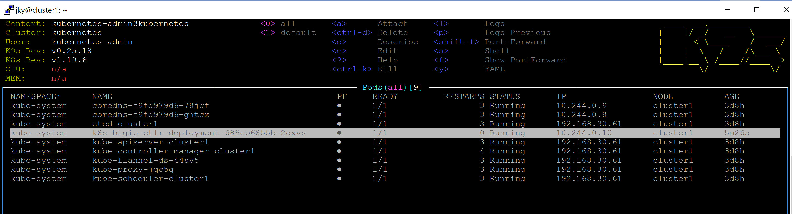
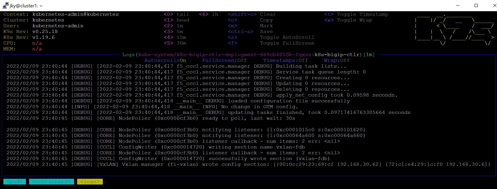

# CIS Installation Note

The earlier note is available [here](README.md).

The note is based on Mark Dittmer's guide available [here](https://github.com/mdditt2000/k8s-bigip-ctlr/tree/main/user_guides/externaldns-nginx).

For easy reference, I clone Mark's repo to local.
```
git clone https://github.com/mdditt2000/k8s-bigip-ctlr
```

Created the CRD:
```
kubectl apply -f k8s-bigip-ctlr/user_guides/externaldns-nginx/cis/cafe/cis-crd-schema/customresourcedefinitions.yml
```

Following the guide:
```
kubectl create secret generic bigip-login -n kube-system --from-literal=username=admin --from-literal=password=admin
kubectl create -f k8s-bigip-ctlr/user_guides/externaldns-nginx/cis/cis-deployment/bigip-ctlr-clusterrole.yaml
```

Updated the `k8s-bigip-ctlr/user_guides/externaldns-nginx/cis/cis-deployment/f5-bigip-ctlr-deployment.yaml` to reflect the real condition in the lab.

1. Change `--bigip-url` to the management IP of BIG-IP. My case is `192.168.10.62`.
2. Change `--gtm-bigip-url` to the management IP of BIG-IP. My case is `192.168.10.62`..
3. Confirm the VXLAN name in `--flannel-name` if it was changed in BIG-IP.

Have a look on other parameters to get them familiarised.

Notice that `--pool-member-type` is set to `cluster`. If you want to know more about it, further info is [here](https://clouddocs.f5.com/containers/latest/userguide/config-options.html#clusterip).

If somehow the Ubuntu host of the k8s cluster has more than 1 vNIC, ensure that the path from the k8s cluster to BIG-IP management IP address is going out via the interface which is in the same network of the internal self-IP of the BIG-IP. In this lab, the VXLAN tunnel endpoint in BIG-IP side is in the internal self-IP.

Once the update to `f5-bigip-ctlr-deployment.yaml` is done, run the following:
```
kubectl create -f k8s-bigip-ctlr/user_guides/externaldns-nginx/cis/cis-deployment/f5-bigip-ctlr-deployment.yaml
```

Last in CIS is to create the logical representation of the BIG-IP in k8s cluster since we are using ClusterIP and Flannel. Update `k8s-bigip-ctlr/user_guides/externaldns-nginx/cis/cis-deployment/f5-bigip-node.yaml` as follow:

1. Change the `VtepMAC` value to the MAC Address of the `fl-vxlan` tunnel in BIG-IP.
2. Change the `public-ip` value to the internal self-IP address of BIG-IP. In my case, it is `192.168.30.62`.
3. Change the `podCIDR` value to the smaller subnet of the self-IP address of the VXLAN of BIG-IP. In my case, it is `10.244.254.0/24`.

Then apply it:

```
kubectl create -f k8s-bigip-ctlr/user_guides/externaldns-nginx/cis/cis-deployment/f5-bigip-node.yaml
```

Ensure that the CIS is working fine. Monitoring its log via k9s shows below:





You can check in BIG-IP that CIS created an entry in FDB:

```
root@(bigip1)(cfg-sync Standalone)(Active)(/Common)(tmos)# list net fdb tunnel fl-vxlan
net fdb tunnel fl-vxlan {
    records {
        72:c1:e4:29:1c:f0 {
            endpoint 192.168.30.61%0
        }
    }
}
root@(bigip1)(cfg-sync Standalone)(Active)(/Common)(tmos)#
```

If all is fine then next is IPAM installation in [here](ipam-note.md).
