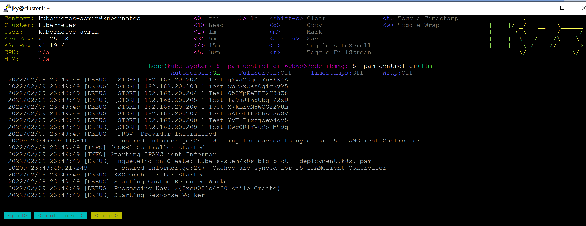

# IPAM Installation Note

The earlier note is available [here](cis-note.md).

The note is based on Mark Dittmer's guide available [here](https://github.com/mdditt2000/k8s-bigip-ctlr/tree/main/user_guides/externaldns-nginx).

Installing IPAM is simple. First is to install the RBAC:
```
kubectl create -f k8s-bigip-ctlr/user_guides/externaldns-nginx/ipam-deployment/f5-ipam-rbac.yaml
```

Second is to install the persistent volume. There are 3 things to be done beforehand in `k8s-bigip-ctlr/user_guides/externaldns-nginx/ipam-deployment/f5-ipam-persitentvolume.yaml`:

1. Change the value of `kubernetes.io/hostname` of the `nodeSelectorTerms` to the hostname of the Ubuntu host. In my case, I used the value in /etc/hostname of the Ubuntu host.
2. (Optional) Change `path` of the `PersistentVolume` to a directory outside `/tmp`. Mine is `/var/tmp/cis_ipam`.
3. Create the directory for the `path` of the `PersistentVolume`. Mine is `sudo mkdir /var/tmp/cis_ipam`.

After that, run it:
```
kubectl create -f k8s-bigip-ctlr/user_guides/externaldns-nginx/ipam-deployment/f5-ipam-persitentvolume.yaml
```

Third is to deploy the IPAM. There are 2 things to update beforehand in `k8s-bigip-ctlr/user_guides/externaldns-nginx/ipam-deployment/f5-ipam-deployment.yaml`:

1. Update the `--ip-range` to the values according to your external VLAN setup. The sample has 2 IP ranges and I just need 1 so I change it below. The value is taken from a range in the external self-IP subnet.
```
- --ip-range='{"Test":"192.168.20.200-192.168.20.210"}'
```

Note: The `ip-range` must be a range with dash (`-`). I tried with only one IP address and it failed. 

2. Note the `runAsUser` value and run the following in the Ubuntu host. The `runAsUser` in my case is `1200`.
```
sudo useradd -u 1200 f5-ipam
sudo chown f5-ipam:f5-ipam /var/tmp/cis_ipam
```

After that, run it:
```
kubectl create -f k8s-bigip-ctlr/user_guides/externaldns-nginx/ipam-deployment/f5-ipam-deployment.yaml
```

Ensure the IPAM is running with k9s:



If all is fine then next is NGINX IC installation [here](nginx-ic-note.md).
